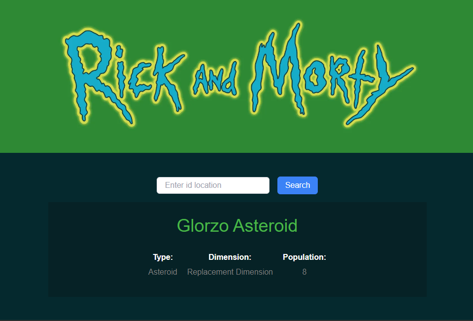
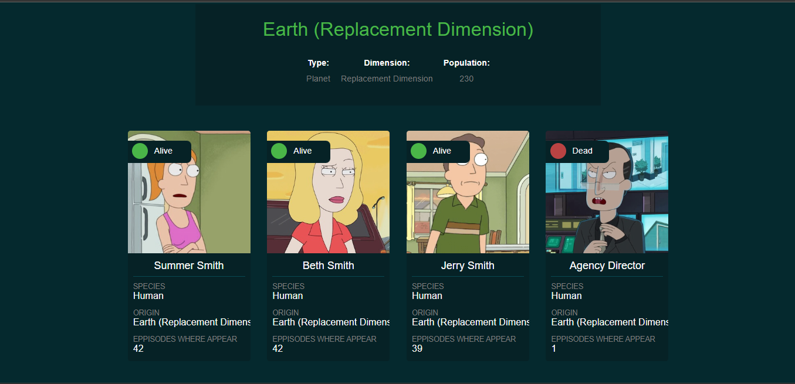

# Rick and Morty App





Esta es una aplicación web que utiliza la API de Rick and Morty para mostrar información sobre los personajes, episodios y ubicaciones de la serie.

## Características

- Muestra información sobre los personajes, episodios y ubicaciones de Rick and Morty.
- Proporciona detalles completos de cada personaje, incluyendo su imagen y estado.
- Muestra información detallada de cada ubicación, como su nombre, tipo, dimensión y lista de residentes.

## Tecnologías utilizadas

- React: Biblioteca JavaScript para construir interfaces de usuario.
- Vite: Build tool rápido y liviano para aplicaciones web.
- Axios: Cliente HTTP para hacer solicitudes a la API de Rick and Morty.
- Tailwind CSS: Framework CSS utilitario para crear interfaces estilizadas de manera rápida.
- Framer Motion: Librería para agregar animaciones y transiciones fluidas a los elementos de la interfaz.

## Instalación

1. Clona este repositorio en tu máquina local:

   ```
   git clone https://github.com/PedroLara14/Rick-And-Morty-APP.git
   ```

2. Navega al directorio del proyecto:

   ```
   cd rick-and-morty-app
   ```

3. Instala las dependencias:

   ```
   npm install
   ```

4. Inicia la aplicación:

   ```
   npm run dev
   ```

   Esto abrirá la aplicación en tu navegador predeterminado en `http://localhost:5173`.

## Uso

- En la página principal, podrás ver una lista de personajes y sus ubicaciones. Ademas podras ingresar el Id correspondiente a cada ubicacion, en este caso hay 126 ubicaciones, por lo tanto deberas ingresar un Id entre 1 y 126.

## Contribuciónes

Si deseas contribuir a este proyecto, ¡serás bienvenido! Puedes abrir un issue para reportar problemas, sugerir nuevas funcionalidades o enviar un pull request con mejoras.